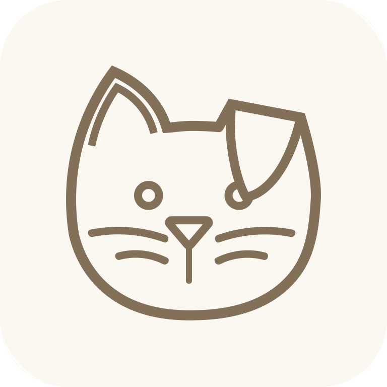

    
    <h1>TasKitty - App</h1>
    Web utilizada para el proyecto de móviles TasKitty

<h2> </h2>
<h2><b>Objetivos</b></h2>

- Buscamos cumplir con los objetivos 14 y 15 de desarrollo sostenible de la Organización de Naciones Unidas.
- Ayudar en el aprendizaje colectivo de las personas para un mejor desarrollo de sus capacidades intelectuales.
- Ayudar en la organización de tareas de las personas individuales.

<h2><b>Tecnologías Utilizadas</b></h2>

- Kotlin

     
    <h2></h2><b>Desarrollado por:</b></h2> 
    

